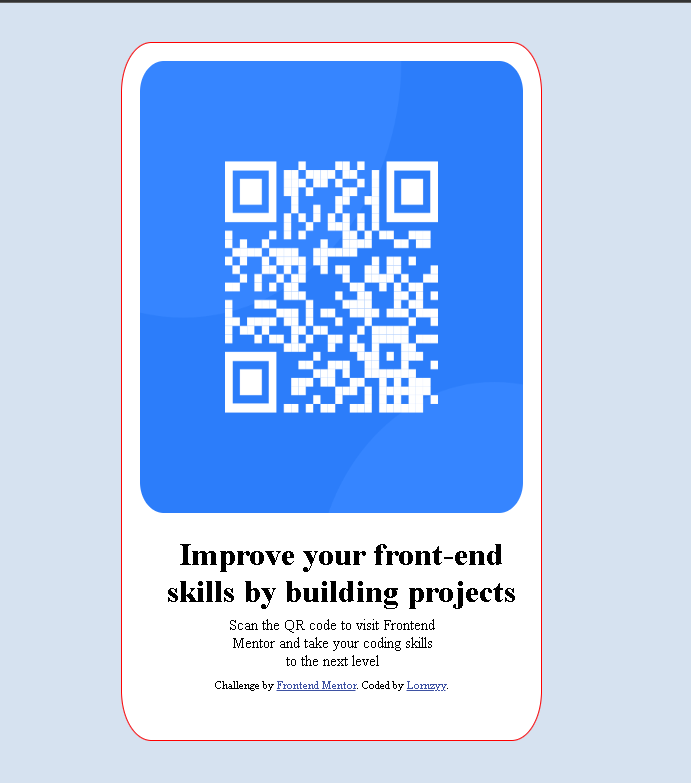

# Frontend Mentor - QR code component solution

This is a solution to the [QR code component challenge on Frontend Mentor](https://www.frontendmentor.io/challenges/qr-code-component-iux_sIO_H). Frontend Mentor challenges help you improve your coding skills by building realistic projects. 

## Table of contents

- [Overview](#overview)
  - [Screenshot](#screenshot)
  - [Links](#links)
- [My process](#my-process)
  - [Built with](#built-with)
  - [What I learned](#what-i-learned)
  - [Continued development](#continued-development)
  - [Useful resources](#useful-resources)
- [Author](#author)


## Overview

### Screenshot




### Links

- Solution URL: [Add solution URL here](https://your-solution-url.com)
- Live Site URL: [Add live site URL here](https://your-live-site-url.com)

## My process

### Built with

- Semantic HTML5 markup
- CSS custom properties
- Flexbox
- CSS Grid
- Mobile-first workflow

### What I learned

I have learnt how to display items and arranging them in a way that ensures all elements are visible to the user.

To see how you can add code snippets, see below:


```css
@media only screen and (max-width: 375px)
{

    body{
        width: 100%;
        height: 100vh;
    }
    .container{
        width: 280px;
        height: 100%;
        align-items: center;
        margin: auto;
    }
```

### Continued development

I will continue focusing on grid in CSS and also CSS in general.

### Useful resources

- [Example resource 1](https://w3school) - This helped me in the media query concept. I understood how it works and will implement it moving forward..


## Author

- Website - [@Lornzyy](https://github.com/Lornzyy)
- Frontend Mentor - [@Lornzyy](https://www.frontendmentor.io/profile/Lornzyy)
- Twitter - [@Lornzyy](https://www.twitter.com/Lornzyy)


